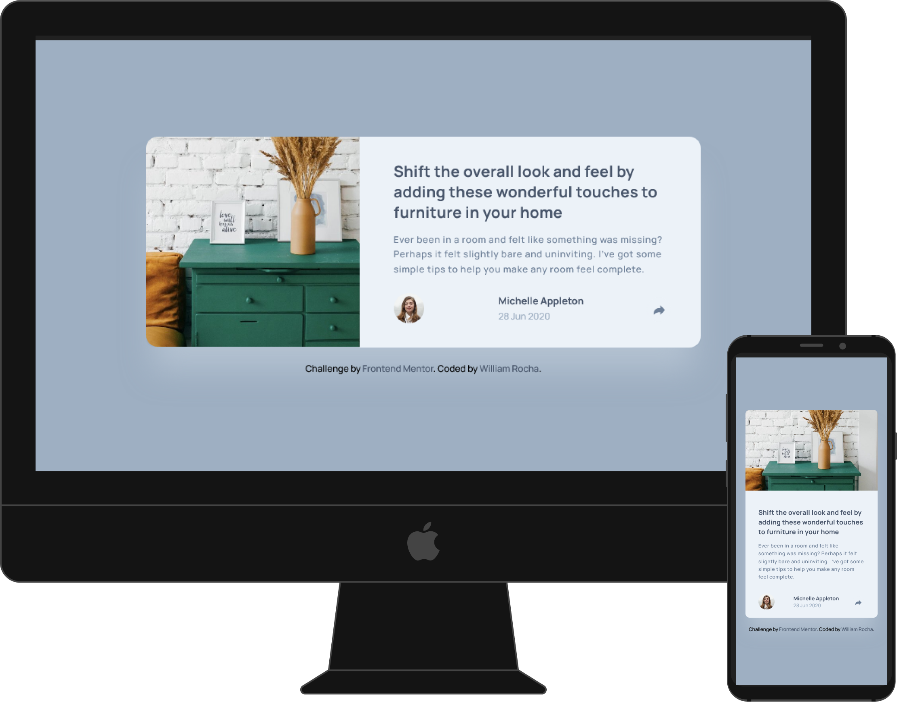

# Frontend Mentor - Article preview component solution

This is a solution to the [Article preview component challenge on Frontend Mentor](https://www.frontendmentor.io/challenges/article-preview-component-dYBN_pYFT). Frontend Mentor challenges help you improve your coding skills by building realistic projects.

## Table of contents

- [Overview](#overview)
  - [The challenge](#the-challenge)
  - [Screenshot](#screenshot)
  - [Links](#links)
  - [Built with](#built-with)
- [Author](#author)
- [Acknowledgments](#acknowledgments)

**Note: Delete this note and update the table of contents based on what sections you keep.**

## Overview

### The challenge

Users should be able to:

- View the optimal layout for the component depending on their device's screen size
- See the social media share links when they click the share icon

### Screenshot

### Links

- Solution URL: https://github.com/WillzinhoRocha/Article-preview-component-challenge-hub
- Live Site URL: https://article-preview-puce-theta.vercel.app/

### Built with

- HTML5
- CSS Grid
- Javascript

## Author

- Website - [William Rocha](https://github.com/WillzinhoRocha)
- Frontend Mentor - [@WillzinhoRocha](https://www.frontendmentor.io/profile/WillzinhoRocha)
- Twitter - [@willzinhorocha](https://twitter.com/willzinhorocha)
